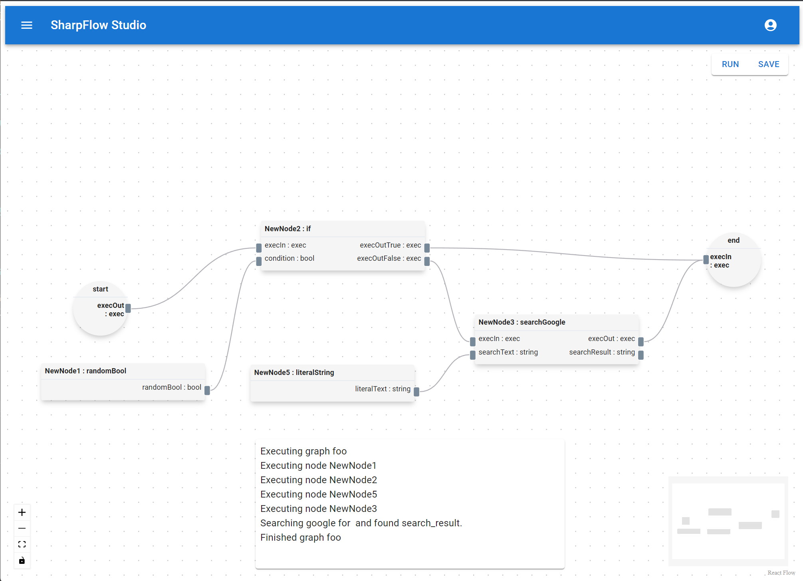

# SharpFlow

SharpFlow is a developer-friendly low code framework where developer writes C# code to build reusable nodes and then build flows between them using a visual editor.

## Example

SharpFlow graphs are built visually by adding nodes and connecting them between handles in SharpFlow Studio.



A node is implemented by inheriting from `NodeBase`, adding handlers, and implmenting the `ExecuteAsync()` method.

```csharp
public class SearchGoogleNode : NodeBase
{
  public SearchGoogleNode(IBufferedLogger logger, string id)
    : base(logger, "searchGoogle", id)
  {
    AddHandle(new ExecHandle("execIn", IHandle.HandleDireciton.Target));
    AddHandle(new StringHandle("searchText", IHandle.HandleDireciton.Target));

    AddHandle(new ExecHandle("execOut", IHandle.HandleDireciton.Source));
    AddHandle(new StringHandle("searchResult", IHandle.HandleDireciton.Source));
  }

  public override async Task ExecuteAsync()
  {
    var inputHandle = GetHandleById("searchText");
    string searchText = (string)inputHandle.Value;

    // Google search (not implemented)
    string searchResult = "search_result";

    BufferedLogger.Log($"Searching google for {searchText} and found {searchResult}.");

    var outputHandle = GetHandleById("searchResult");
    outputHandle.Value = searchResult;
  }
}
```

The Framework automatically scan for and add new nodes.

## Use Cases

The primary use-case for automation.  Developers build re-usable nodes that performs a certain complex operation such as calling an API endpoint or browser automation.  These nodes are then used by non-developers to archive a set of operations in a certain order or condition.

## Features / Progress

- A functional SharpFlow Studio. [WIP]
- Ability to save and load graphs. [WIP]
- SqlLite database for persistence. [WIP]
- API-based execution of graphs. [WIP]
- Headless code-based execution of graphs. [Planned]
- `if` condition Node. [Done]
- For loop node. [Planned]
- Parameterized Start/End nodes, and Graph invocation node.  Ability to execute graphs inside of a graphs. [Planned]

